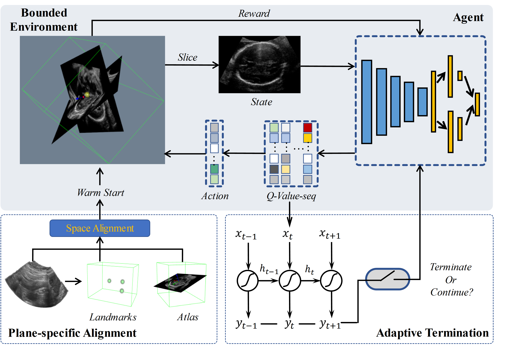

# Reinforced Framework for Standard Plane Localization in 3D US.

This repository is the implementation of the deep reinforced framework for standard plane localization by Haoran Dou in MUSIC Lab at Shenzhen University.

**Agent with Warm Start and Active Termination for Plane Localization in 3D Ultrasound**  
*Haoran Dou, Xin Yang, Jikuan Qian, Wufeng Xue, Hao Qin, Xu Wang, Lequan Yu, Shujun Wang, Yi Xiong, Pheng-Ann Heng, and Dong Ni.*  
International Conference on Medical Image Computing and Computer Assisted Intervention, 2019. [[Paper]](https://link.springer.com/chapter/10.1007/978-3-030-32254-0_33) [[arXiv]](https://arxiv.org/abs/1910.04331)

  

> Standard plane localization is crucial for ultrasound (US) diagnosis. In prenatal US, dozens of standard planes are manually acquired with a 2D probe. It is time-consuming and operator-dependent. In comparison, 3D US containing multiple standard planes in one shot has the inherent advantages of less user-dependency and more efficiency. However, manual plane localization in US volume is challenging due to the huge search space and large fetal posture variation. In this study, we propose a novel reinforcement learning (RL) framework to automatically localize fetal brain standard planes in 3D US. Our contribution is two-fold. First, we equip the RL framework with a landmark-aware alignment module to provide warm start and strong spatial bounds for the agent actions, thus ensuring its effectiveness. Second, instead of passively and empirically terminating the agent inference, we propose a recurrent neural network based strategy for active termination of the agent's interaction procedure. This improves both the accuracy and efficiency of the localization system. Extensively validated on our in-house large dataset, our approach achieves the accuracy of 3.4mm/9.6° and 2.7mm/9.1° for the transcerebellar and transthalamic plane localization, respectively. Ourproposed RL framework is general and has the potential to improve the efficiency and standardization of US scanning.

## Usage  
Code coming soon

## Citation  
If this work is helpful for you, please cite our paper as follows:   
```
@inproceedings{dou2019agent,
  title={Agent with Warm Start and Active Termination for Plane Localization in 3D Ultrasound},
  author={Dou, Haoran and Yang, Xin and Qian, Jikuan and Xue, Wufeng and Qin, Hao and Wang, Xu and Yu, Lequan and Wang, Shujun and Xiong, Yi and Heng, Pheng-Ann and others},
  booktitle={International Conference on Medical Image Computing and Computer-Assisted Intervention},
  pages={290--298},
  year={2019},
  organization={Springer}
}
```

